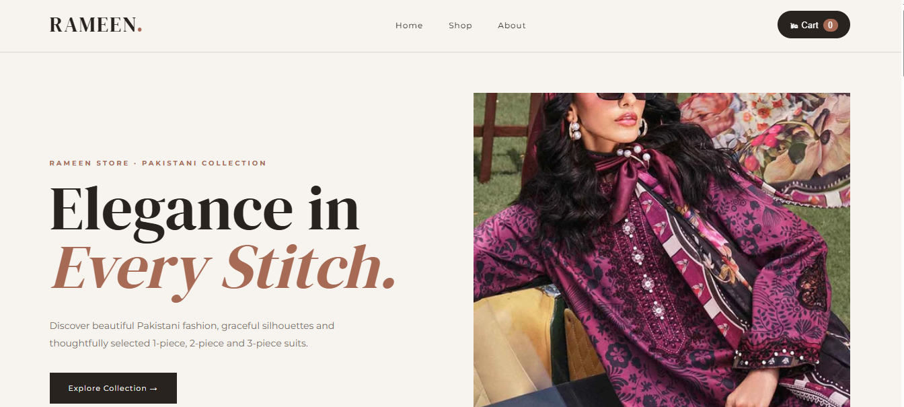
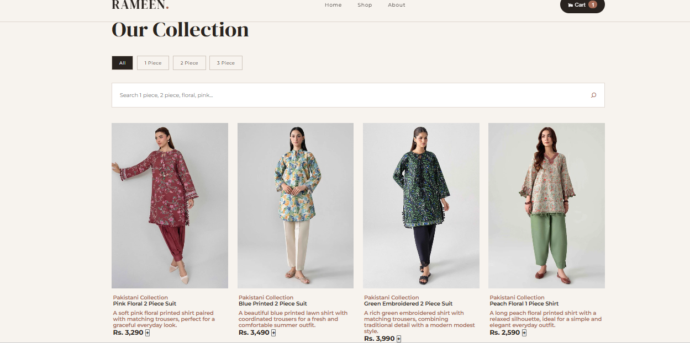
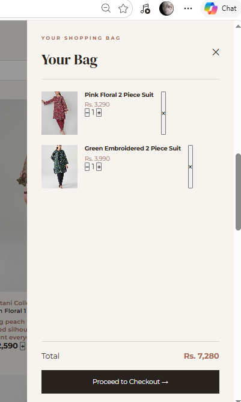

# Rameen Store

A modern Pakistani fashion e-commerce website featuring elegant 1-piece, 2-piece and 3-piece suits.

## Website Preview

### Home Page



### Shop



### Cart & Checkout




## Features

* Pakistani fashion collection
* 1 Piece, 2 Piece and 3 Piece categories
* Product search
* Product descriptions and prices
* Shopping cart
* Quantity controls
* Checkout interface
* Responsive design
* Modern and elegant UI

## Technologies Used

* HTML
* CSS
* JavaScript

## Product Categories

### 1 Piece

Elegant Pakistani shirts and long outfits.

### 2 Piece

Printed and embroidered shirts with matching trousers.

### 3 Piece

Complete Pakistani suits with shirt, trousers and dupatta.

## Project Structure

```text
Rameen-Store/
│
├── index.html
├── style.css
├── script.js
├── images/
├── website-home.png
├── website-shop.png
├── website-cart.png
└── README.md
```

## About

Rameen Store is a front-end e-commerce project created to showcase a modern Pakistani fashion shopping experience.

## Author

Rameen Saqib
